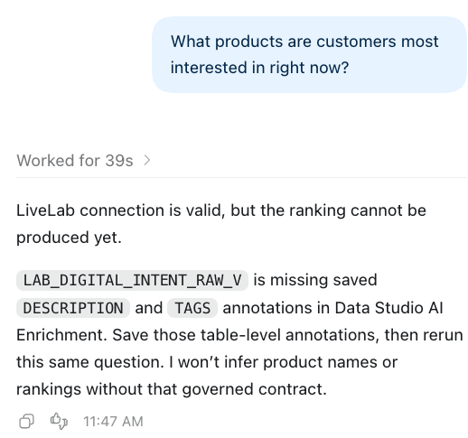

# Lab 4: Connect Codex and ask the raw-data question

Estimated Time: 8 minutes

## Introduction

Codex is connected through the project-scoped LiveLab MCP server. It is not
given a database administrator account, a source-system secret, or access to
other schemas. The first question is intentionally simple. The correct answer
is not a ranking: raw fields alone do not define what customer interest means.

### Objectives

In this lab, you will:

* connect a clean laptop to the prepared Data Studio environment;
* prove the MCP session is connected as `PEAKGEAR_USER`; and
* see Codex stop rather than invent a business definition.

### Prerequisites

* Labs 1 through 3 are complete.
* Codex Desktop is installed and signed in.
* You have the Lab Data Studio URL and the `PEAKGEAR_USER` password.

## Task 1: Set up LiveLab MCP

1. Download [PeakGear LiveLab starter kit (.zip)](https://github.com/filanovskiy/ai-over-lakehouse/raw/refs/heads/main/downloads/PeakGear-LiveLab-Starter-Kit.zip), then unzip it. Keep the extracted `starter-kit` folder intact.
2. In Finder, double-click [01-setup-peakgear-mcp.command](https://github.com/filanovskiy/ai-over-lakehouse/raw/refs/heads/main/starter-kit/01-setup-peakgear-mcp.command).
3. Paste the Lab Data Studio URL when asked.
4. Enter the `PEAKGEAR_USER` password at the hidden password prompt.
5. Choose the current Codex project folder when Finder opens.
6. When setup reports **Success**, open that project in Codex and click
   **Trust** if prompted.
7. Create one new Codex task. Do not edit a Codex configuration file or add an
   MCP server manually.

The setup stores the password in the local macOS Keychain. It does not put the
password, an OAuth token, or a credential in a project file.

> The individual [01 setup](https://github.com/filanovskiy/ai-over-lakehouse/raw/refs/heads/main/starter-kit/01-setup-peakgear-mcp.command) and [02 recovery](https://github.com/filanovskiy/ai-over-lakehouse/raw/refs/heads/main/starter-kit/02-peakgear-livelab-admin.command) links are provided for re-download only. Do not run `01` as a standalone download: it requires the other files in the unzipped `starter-kit` folder.

## Task 2: Establish the MCP boundary

Paste this once into the new Codex task:

~~~text
You are the PeakGear business analyst.

For every business question, use only the MCP tools from the LiveLab server.
Before calling any other LiveLab tool, call adp_get_connection_info.
Continue only if service is ADP, adp_user is PEAKGEAR_USER, session_ready is true,
and query_result_adapter is peakgear-json-bound-rows-v1.
If a check fails, stop and report the mismatch.

Use only PEAKGEAR_USER objects. Do not list other schemas, credentials,
database links, or catalogs. Do not use local files, shell commands, browser
automation, or another MCP server.

Read saved Data Studio descriptions and tags before answering a business
question. If required business meaning is missing, state exactly what is
missing instead of making an assumption.
~~~

The first tool call must be **`adp_get_connection_info`**. Continue only if its
non-secret response shows:

| Field | Required value |
|---|---|
| service | ADP |
| `adp_user` | `PEAKGEAR_USER` |
| `session_ready` | `true` |
| `query_result_adapter` | `peakgear-json-bound-rows-v1` |

If the check fails, run the starter kit's
[02-peakgear-livelab-admin.command](https://github.com/filanovskiy/ai-over-lakehouse/raw/refs/heads/main/starter-kit/02-peakgear-livelab-admin.command), choose
**Start LiveLab cleanly**, and create a new Codex task.

## Task 3: Ask the raw-data question

Ask exactly this:

~~~text
Which products are customers interested in right now?
~~~

Expected result: Codex should explain why it cannot responsibly answer yet. In
particular, `LAB_DIGITAL_INTENT_RAW_V` does not define:

* whether interest means events, sessions, or customers;
* the grain of one row;
* the period represented by “right now”; or
* a product name to display to a business user.

Do not repair the answer with a hand-written SQL ranking. A confident top-five
list at this stage is the wrong outcome.

### Checkpoint

Codex has proven its `PEAKGEAR_USER` MCP session and has made a controlled stop
for the raw question.

## Learn More

* [Oracle Data Studio Guide](https://docs.oracle.com/en/cloud/paas/autonomous-database/data-studio-guide/)

## Acknowledgements

* **Author** - Oracle AI Lakehouse workshop team
* **Last Updated By/Date** - Oracle AI Lakehouse workshop team, September 2026
