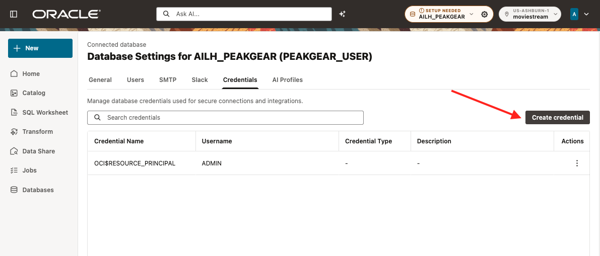
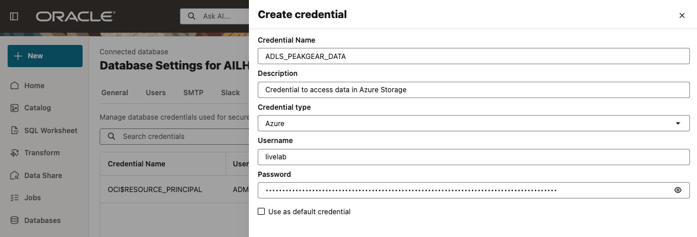
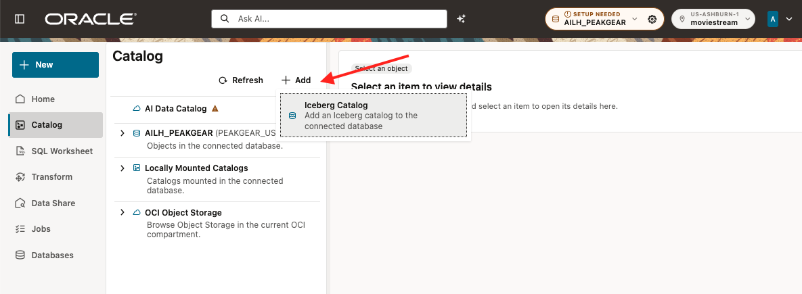
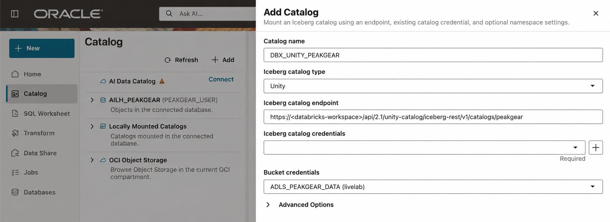
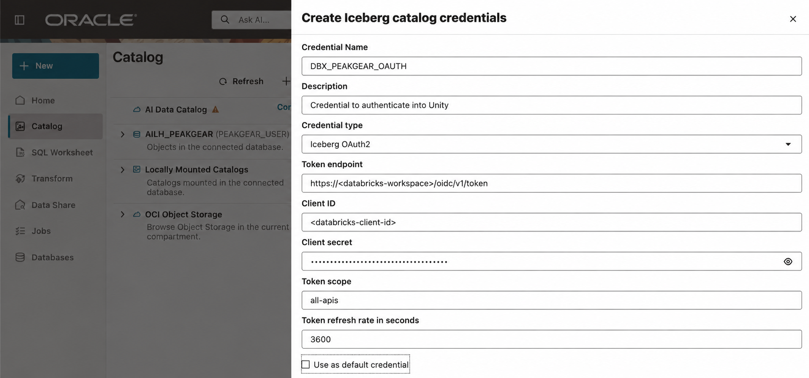
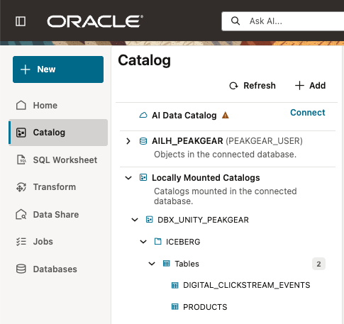

# Lab 3: Connect real sources

Estimated Time: 15 minutes

## Introduction

PeakGear does not copy source data into a staging table. It connects two live
systems:

* Databricks Unity Catalog supplies the Iceberg product catalog and digital
  clickstream events.
* The existing Oracle Operations database supplies return events through the
  public database link created in Lab 1.

You will connect Databricks through the Data Studio UI, add a Lake Cache policy
immediately after the mount, and create three participant-owned raw views.

### Objectives

In this lab, you will:

* create the Azure storage and Databricks OAuth credentials in Data Studio;
* mount the Databricks Unity Iceberg catalog;
* add, but not claim performance for, a Lake Cache policy;
* prove access to the two connected sources; and
* create the three raw business objects used by Codex.

## Task 1: Create the two Databricks credentials in Data Studio

Use **Databases** in the Data Studio navigation to open the credential
experience. Create the following credentials with the values from the private
lab handout:

| Credential | Purpose | Value type |
|---|---|---|
| ADLS_PEAKGEAR_DATA | Read Iceberg files in Azure Blob Storage | Read-only Azure SAS |
| DBX_PEAKGEAR_OAUTH | Obtain renewable Unity Catalog access tokens | Databricks OAuth client |

Keep the supplied names exactly. Review the form, then save each credential.
The credentials are owned by PEAKGEAR_USER. Do not create them as ADMIN.

## Task 2: Mount the Databricks Unity Catalog

In **Catalog**, click **Add**, then choose **Iceberg catalog**.

Enter:

| Field | Value |
|---|---|
| Local catalog name | DBX_UNITY_PEAKGEAR |
| Catalog type | Databricks Unity / Iceberg REST |
| Catalog credential | DBX_PEAKGEAR_OAUTH |
| Data storage credential | ADLS_PEAKGEAR_DATA |
| Catalog endpoint | The Unity Iceberg REST endpoint from the private handout |

When **Iceberg catalog credentials** is required, click the plus sign and
create the OAuth credential with the values from the private handout.

Return to the catalog form, select DBX_PEAKGEAR_OAUTH, save the mount, and
refresh its catalog metadata. The catalog must expose the ICEBERG schema with
PRODUCTS and DIGITAL_CLICKSTREAM_EVENTS.

## Task 3: Add the Lake Cache policy

Immediately after the mount, create and populate a Lake Cache policy for both
mounted tables. Run the following in SQL Worksheet as PEAKGEAR_USER. If the
inspection query already shows a policy, verify it instead of recreating it.

~~~sql
SELECT external_table_name,
       cached,
       cache_cur_size / 1024 / 1024 AS cache_size_mb,
       disabled
FROM user_external_tab_caches
ORDER BY external_table_name;

BEGIN
  DBMS_EXT_TABLE_CACHE.CREATE_CACHE(
    owner          => 'PEAKGEAR_USER',
    table_name     => 'ICEBERG.PRODUCTS@DBX_UNITY_PEAKGEAR',
    partition_type => 'FILE'
  );
END;
/

BEGIN
  DBMS_EXT_TABLE_CACHE.CREATE_CACHE(
    owner          => 'PEAKGEAR_USER',
    table_name     => 'ICEBERG.DIGITAL_CLICKSTREAM_EVENTS@DBX_UNITY_PEAKGEAR',
    partition_type => 'FILE'
  );
END;
/

BEGIN
  DBMS_EXT_TABLE_CACHE.ADD_TABLE(
    owner         => 'PEAKGEAR_USER',
    table_name    => 'ICEBERG.PRODUCTS@DBX_UNITY_PEAKGEAR',
    percent_files => 100
  );
END;
/

BEGIN
  DBMS_EXT_TABLE_CACHE.ADD_TABLE(
    owner         => 'PEAKGEAR_USER',
    table_name    => 'ICEBERG.DIGITAL_CLICKSTREAM_EVENTS@DBX_UNITY_PEAKGEAR',
    percent_files => 100
  );
END;
/
~~~

Run the inspection query again. CACHE_CUR_SIZE greater than zero proves that
files were populated. It does not prove that an enabled cache is correct or
faster. In the current lab environment, keep a disabled policy disabled if it
reports the known duplicate-read behavior. Do not claim acceleration without a
verified query plan and runtime comparison.

<!-- Screenshot to insert after approved dry run: images/lake-cache-policy.png
     Alt text: SQL Worksheet shows the PeakGear Lake Cache policy and its
     populated or disabled state for the two mounted Iceberg tables. -->

## Task 4: Prove the two live sources

Open SQL Worksheet as PEAKGEAR_USER and run:

~~~sql
SELECT COUNT(*) AS products
FROM iceberg.products@dbx_unity_peakgear;

SELECT COUNT(*) AS digital_clickstream_events
FROM iceberg.digital_clickstream_events@dbx_unity_peakgear;

SELECT COUNT(*) AS operational_return_events
FROM customer_return_events@peakgear_operations_link;
~~~

All three queries must return a count. Then create the raw, participant-owned
views:

~~~sql
CREATE OR REPLACE VIEW lab_products_raw_v AS
SELECT product_id,
       product_name,
       category AS category_name
FROM iceberg.products@dbx_unity_peakgear;

CREATE OR REPLACE VIEW lab_digital_intent_raw_v AS
SELECT product_id,
       session_id,
       customer_id,
       CAST(event_ts AS TIMESTAMP) AS event_ts
FROM iceberg.digital_clickstream_events@dbx_unity_peakgear;

CREATE OR REPLACE VIEW lab_returns_raw_v AS
SELECT product_id,
       store_id,
       return_qty,
       CAST(return_created_at AS TIMESTAMP) AS return_created_at
FROM customer_return_events@peakgear_operations_link;
~~~

These views do not copy data and do not add business definitions. They give
PEAKGEAR_USER a small, owned surface for Data Studio and the bounded MCP
server.

### Checkpoint

You can read both Iceberg tables and the Operations return table. The three
LAB raw views exist under PEAKGEAR_USER.

## Learn More

* [Oracle Data Studio Guide](https://docs.oracle.com/en/cloud/paas/autonomous-database/data-studio-guide/)

## Acknowledgements

* **Author** - Oracle AI Lakehouse workshop team
* **Last Updated By/Date** - Oracle AI Lakehouse workshop team, September 2026
